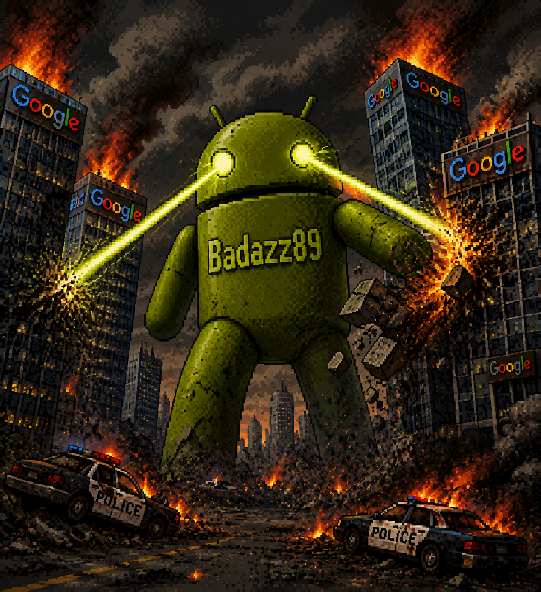

<div align="center">
  
  <h1>BadazzKernel</h1>
  <p>Gaming-optimierter Kernel für <b>SM7150 (sweet / sweetin)</b> — 4.14.369</p>
  <p>
    
    
    
    
    
  </p>
</div>

---

## Überblick

BadazzKernel ist ein auf Performance und Gaming getrimmter Kernel für das **Redmi Note 12 Pro 4G (sweet / sweetin)**. Kernstück ist der In-Kernel-Governor **k6a_gov v1.3.1** — optimale Basis für das Begleitmodul **[k6a-ctl](https://github.com/vandalsquad187/k6a-ctl)**. Beide arbeiten im Delegated-Modus Hand in Hand: Kernel drosselt, Modul steuert.

---

## Architektur

```
linux-4.14.369
├── KernelSU-Next 33300 (UAPIv2) + SUSFS        # Root + Hide
├── drivers/thermal/k6a_gov/k6a_gov.c v1.3.1   # In-Kernel Gaming Governor
├── drivers/gpu/msm/kgsl_pwrctrl.c             # GPU Pwrlevel Export (k6a_gov)
├── drivers/devfreq/devfreq.c                  # BW Floors (gpubw / llcc)
├── drivers/gpu/msm/ + drivers/thermal/        # Thermal + Cooling Floors
└── arch/arm64/boot/dts/qcom/                  # sweet / sdmmagpie DT
```

### Kernel-Features

| Bereich | Feature | Details |
|---------|---------|---------|
| **Governor** | **k6a_gov v1.3.1** | Built-in (`CONFIG_K6A_GOV=y`), State Machine OFF→GAMING→CD_L2/L3/L4, Hysterese, Throttle-History (16) |
| **CPU** | Gold-Clamp | `find_gold_cpu()` + `clamp_freq`, `enforce_max_freq` + `cpufreq_update_policy` (Kthread only), Notifier hardened |
| **Temp** | Multi-Zone | Max über 4 Gold-Zonen `cpu-1-0..3-usr`, Fallback `xo-therm`/`soc-therm` |
| **GPU** | Native Enforcement | `kgsl_k6a_get_levels` / `kgsl_k6a_set_max_level_idx`, Caps pro CD-State |
| **BW** | Devfreq Floors | `k6a_devfreq_set_bw` für `gpubw` + `cpu-llcc-ddr-bw`, pro Profil/CD-State, reset bei disable |
| **Profile** | 6 Profile | `off/gaming/battery/badazz/custom/badazz_safe` — Temps, Gold/GPU/BW Floors |
| **Safety** | Battery Guard + Hash | `battery_guard` @45°C → CD_L2, `poll_ms` 100..5000, `verify_build_hash` vs `k6a_features/git_hash` |
| **Thermal** | Cooling Device | `k6a_gov` als `thermal_cooling_device`, `cool_cur` locked, `K6A_CD_L4` clamp |
| **Root** | KSU-Next + SUSFS | 33300 UAPIv2, SUSFS v4 enable_log/sus_path/mount/kstat/map, syscall tamper |
| **Scheduler** | UCLAMP, SCHED_CASS | Latenz/Effizienz Tuning |
| **Memory** | KSM, LRU_GEN, ZRAM lz4 | Gaming-Stabilität |
| **Net** | BBR | Low-latency |
| **Wakelock** | BOEFFLA_WL_BLOCKER | Blockiert unnötige Wakelocks |
| **Monitor** | MSM_PERFORMANCE, PSI | `cpu_freq_times`, Pressure-Stall |

---

## Zusammenspiel mit k6a-ctl

Das Modul **[k6a-ctl v1.1.0](https://github.com/vandalsquad187/k6a-ctl)** ist der Userspace-Companion:

```
k6a-ctl v1.1.0 (delegated=1)
├── k6a-controller   # Game-Detection, schedutil, auto badazz_safe @85°C
├── k6a-lib.sh       # gov_write/gov_read Helpers
├── settings.conf    # delegated, profile, auto_badazz_temp
├── check_module.sh  # delegation-aware Gate
└── WebUI            # Gov-Status, BW-Floors, GPU-Caps, History
```

**Delegated-Modus** (`delegated=1`, Default): Kernel-Governor steuert Thermal (CPU/GPU/BW), Modul macht Game-Detection + Sched-Tuning + Monitoring. Legacy (`delegated=0`) nur Fallback.

### Kernel-Schnittstellen (`/sys/kernel/k6a_gov/`)

| Node | R/W | Zweck |
|------|-----|-------|
| `enable` | RW | 0/1 — Not-Aus, resettet BW-Floors + GPU-Cap |
| `profile` | RW | 0..5 — off/gaming/battery/badazz/custom/badazz_safe |
| `status` | RO | `version/state/temp/ticks/throttle_events/gold_* /bw_* /hash_verified/hist=` |
| `hysteresis` | RW | `fast normal` — Dwell ms (z.B. `3 10`) |
| `cd_thresholds` | RW | `l2t l3t l4t rec l2g l3g l4g` — 7 Werte, Celsius |
| `gpu_caps` | RW | `l2 l3 l4` — GPU Hz Caps |
| `bw_floors` | RW | `gpubw_l2 l3 l4 llcc_l2 l3 l4` — 6 BW Floors |
| `battery_guard` | RW | 0/1 — Akku-Wächter 45°C |
| `poll_ms` | RW | 100..5000 — Kthread Intervall |
| `legacy` | RW | 0/1 — Enforcement an/aus |
| `game_pid` | RW | PID des Games |

> **Kernel stellt die Hebel — k6a-ctl zieht dran.** Ohne Modul läuft k6a_gov mit sicheren Defaults. Mit Modul dynamisch nach Last/Temperatur.

---

## Installation

1. **Release** von [GitHub Releases](https://github.com/vandalsquad187/BadazzKernel/releases) laden
2. ZIP via **OrangeFox / TWRP** flashen (AnyKernel3)
3. **KernelSU-Next Manager** APK installieren (≥33300)
4. (Empfohlen) **[k6a-ctl](https://github.com/vandalsquad187/k6a-ctl)** Modul installieren — `delegated=1`

### Build (Dev)

```bash
git clone https://github.com/vandalsquad187/BadazzKernel && cd BadazzKernel
git submodule update --init --recursive
make ARCH=arm64 CROSS_COMPILE=aarch64-linux-gnu- sweet_defconfig
make ARCH=arm64 CROSS_COMPILE=aarch64-linux-gnu- -j$(nproc)
# ZIP:
cp arch/arm64/boot/Image.gz anykernel/ && cp arch/arm64/boot/dtb.img anykernel/ && cp arch/arm64/boot/dtbo.img anykernel/
cd anykernel && zip -r9 ../BadazzKernel-sweet-k6a-gov-v1.3.1.zip . -x "*.git*"
```

CI baut automatisch bei jedem Push auf `main` ein Release.

---

## Status & Debug

```bash
dmesg | grep k6a_gov          # v1.3.1 loaded, hash_verified, gpu levels
cat /sys/kernel/k6a_gov/status
cat /sys/kernel/k6a_gov/battery_guard; cat /sys/kernel/k6a_gov/poll_ms
echo 0 > /sys/kernel/k6a_gov/enable  # Not-Aus
```

k6a-ctl: `check_module.sh` validiert delegated/profile, WebUI zeigt Gov-Status live.

---

## Versionen

| Version | Highlights |
|---------|------------|
| **v1.3.1** | Hardening: `find_gold_cpu`, notifier/mutex fixes, `cool_cur`/`status_show` locked, `ticks` fix |
| v1.3.0 | BW Floors write, hash coupling, `badazz_safe` Profil 5 |
| v1.2.1 | `badazz_safe`, multi-zone temp, `clamp_freq` fix |
| v1.2.0 | GPU enforcement, history ringbuffer, BW monitor RO |
| v1.1.2 | `battery_guard`, `poll_ms`, GPU levels RO |

Full Changelog: `git log --oneline`

---

## Download

| Quelle | Link |
|--------|------|
| BadazzKernel Releases | [GitHub](https://github.com/vandalsquad187/BadazzKernel/releases) |
| k6a-ctl (Companion) | [GitHub](https://github.com/vandalsquad187/k6a-ctl) |

---

## Credits

- **BadazZ89** — Kernel, k6a_gov
- **vandalsquad187** — Base, CI
- **KernelSU-Next / SUSFS** — Root/Hide
- **AnyKernel3** — Flash Template

---

## Lizenz

GPL v2 — siehe `COPYING`.
